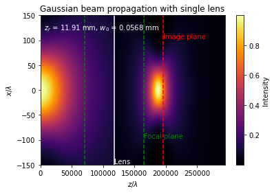

@author: SM
"""

# Gaussian Beam Propagation

Under modules, the GaussianBeam python script contains a class for simulating beam propagation and calculating the relevant parameters. An example script shows how beam behaves under single lens transformation based on ABCD matrices and q-parameter. 

## Scripts
- `GaussianBeam.py`: Class containing functions used for building a beam propagation simulation.
- `Singlelens_gaussianbeal.py`: An example script that uses the Class script to build a single lens beam propagation simulation.
## Python libraries 
- numpy, matplotlib

## Example: Gaussian beam through a single lens
All relevant inputs are given in mm.

 
