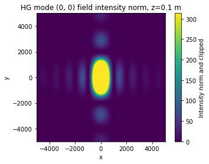

# -*- coding: utf-8 -*-
"""


@author: SM
"""

# Optical elements

The class OpticalElements contains functions to simulate optical elements such as slits. The example folder contains an example simulation
of diffraction from rectangular and circular slits of a Hermite-Gaussian beam mode.


## Scripts
- `opticalelements.py`: Class containing functions for rectangular and circular slits
- `tools.py`: Contains a function that converts .txt file of a certain format into python dictionary


## Python libraries 
- numpy, matplotlib, sys

## Example: Diffraction of a fundamental Gaussian mode from slits 
An HG mode is simulated following the parameters specified in a .txt file. These are given below:

### Inputs
An example of the inputs required in a .txt file is shown in the following:
```text
'mode_type':           Hermite-Gaussian #
'wavelength':          1000E-9 #in meters
'field_amplitude':     10 #constant amplitude of field
'waist_radius':        1E-3 #in meters
'n_m':		       (0,0) #n,m order of hermite polynomial upto(3,3)
'sample_points':       2000 #
'grid_size':           (10E-3,10E-3) # meters 
'propagation_distance': 0.1 #in meters
```
### Diffraction from rectangular slit (100 um x 50 um) after a propagation of 10 cm


